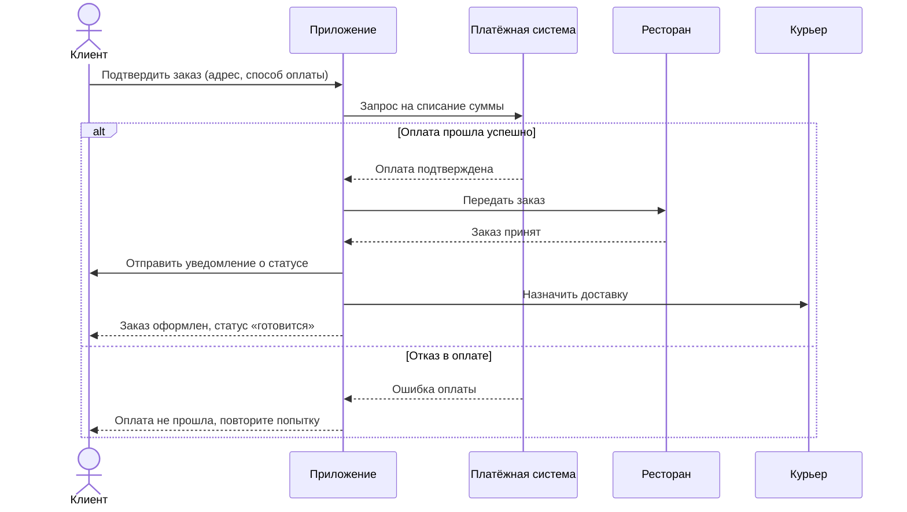

# Sequence Diagram: онлайн-оплата и оформление заказа

```mermaid
sequenceDiagram
    actor Client as Клиент
    participant App as Приложение
    participant Pay as Платёжная система
    participant Rest as Ресторан
    participant Courier as Курьер

    Client->>App: Подтвердить заказ (адрес, способ оплаты)
    App->>Pay: Запрос на списание суммы
    alt Оплата прошла успешно
        Pay-->>App: Оплата подтверждена
        App->>Rest: Передать заказ
        Rest-->>App: Заказ принят
        App->>Client: Отправить уведомление о статусе
        App->>Courier: Назначить доставку
        App-->>Client: Заказ оформлен, статус «готовится»
    else Отказ в оплате
        Pay-->>App: Ошибка оплаты
        App-->>Client: Оплата не прошла, повторите попытку
    end
```